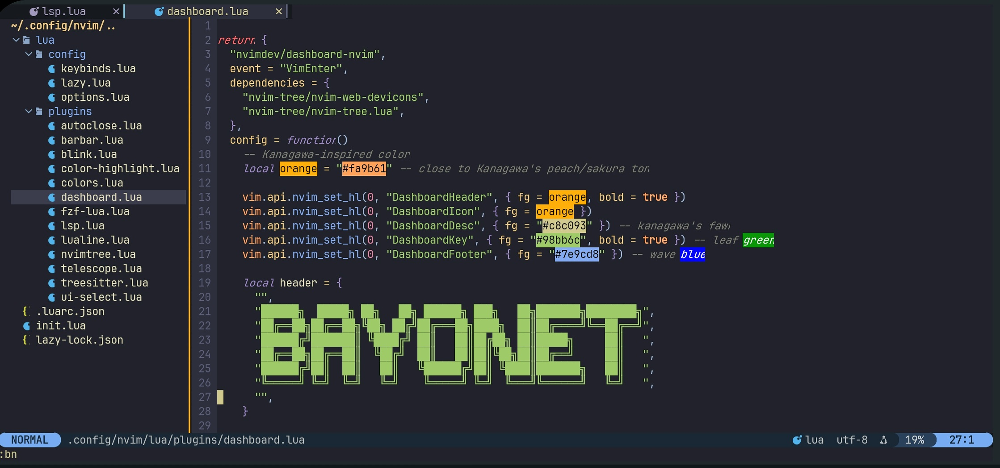

# termux-nvim-setup

a simple setup for neovim on termux with all the essential plugins and configs to make your terminal coding experience smooth

## features

- preconfigured neovim setup optimized for termux
- syntax highlighting for various programming languages
- auto completion
- file explorer
- beautiful color schemes
- fuzzy finding
- custom keybindings for faster workflow

## Preview ##



> [!IMPORTANT]
> **you can change  your dashboard logo by opening `lua/plugins/dashboard.lua`**
>
> *you can get the ascii of your choice at [ascii-gen-site](https://patorjk.com/software/taag/#p=display&f=Graffiti&t=Type%20Something%20)*
> 
>  *choose font sytle'ANSI SHADOW' if you want the logo to be like mine*


## requirements
- termux app.
*Link:(https://github.com/termux/termux-app/releases/)*  
- termx:api 
*Link: (https://github.com/termux/termux-api/releases)*
- basic knowledge of terminal commands
- internet connection for downloading plugins


> [!WARNING]
> *only use the github or fdroid version of termux as the playstore version is outdated*

## installation

### clone the repo

```
git clone https://github.com/BayonetArch/termux-nvim-setup.git
```

### run the install script

```
cd termux-nvim-setup
chmod +x install.sh
./install.sh
```

the script will install all necessary dependencies and set up your neovim configuration

> [!TIP]
> **CONFIGURE** 
>
> `init.lua`  
> **This is the main configuration file.**
> 
> `lua/plugins/your_plugin.lua`  
> **Manage plugins or add your own plugins here.**
> 
> `lua/config/keybinds.lua`  
> **View, change, or add keybindings here.**

## usage
*start neovim with command*: 
```bash
nvim
```
  
> [!CAUTION]
> *after installing and opening the nvim you might get some errors wait till all plugins and treesitter is compiled and just restart termux*


## troubleshooting

**If you run into any issues or have questions, feel free to ask in the comments on my [YouTube channel](https://www.youtube.com/@Bayonet7) or open an issue in this repo. I’ll try to respond as soon as I can.**


